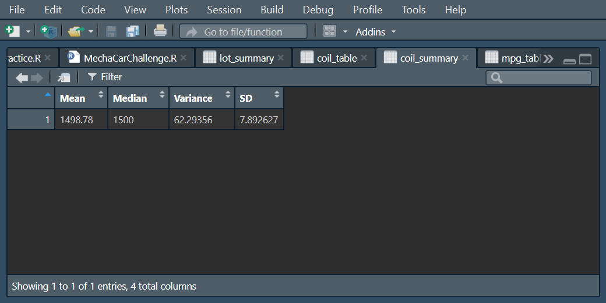
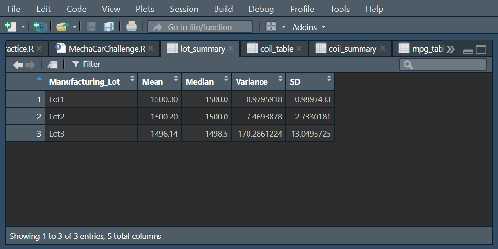

# MechaCar_Statistical_Analysis

## Linear Regression to Predict MPG

First we need to assess the quality of the dataset by looking at the distribution of the data. We can see in the 'Residuals' section that the data follows a normal distribution with comparable min and max values comparable (-19.47 and 18.58 respectively) and the median -.07 is close to zero.

Looking at the individual variable p-values in the summary output (left here), each Pr(>|t|) value represents the probability that each coefficient contributes a random amount of variance to the linear model. According to our results, vehicle length and ground clearance (as well as intercept) are statistically unlikely (<=0.05) to provide random amounts of variance to the linear model. In other words the vehicle length and ground clearance have a significant impact on mpg efficiency.
 

 

In addition, the p-value of our linear regression analysis is 4.541 x 10-11, which is much smaller than our assumed significance level of 0.05%. Therefore, we can state that there is sufficient evidence to reject our null hypothesis, which means that the slope of our linear model is not zero.
 

The multiple R-squared value of our linear regression analysis is 0.7149, which means that our model represents and predicts the correlation between all 6 variables with a precision of 71.5%, which is strong but could be improved for instance by adding other variables to the model or analyzing a larger dataset.
 

Besides, when an intercept is statistically significant, it means that the intercept term explains a significant amount of variability in the dependent variable when all independent variables are equal to zero. A significant intercept could mean either that the significant features (such as length and ground clearance) may need scaling or transforming to help improve the predictive power of the model, or that there are other variables that can help explain the variability of our dependent variable that have not been included in our model. Our intercept here is statistically insignificant, so the predictive power of the model is quite high.
 

## Summary Statistics on Suspension Coils

The variance for the total manufacturing lot is 62 < 100, which is within the expected design specifications of staying under 100 PSI.
 

 

However, when reviewing the data by Lot number, Lot 3 is a large contributing factor to the variance being high. Lot 3 shows a variance of 170 > 100 and does not meet the design specifications. Lot 1 and Lot 2 have significantly lower variance, 1 and 7 respectively.
 
