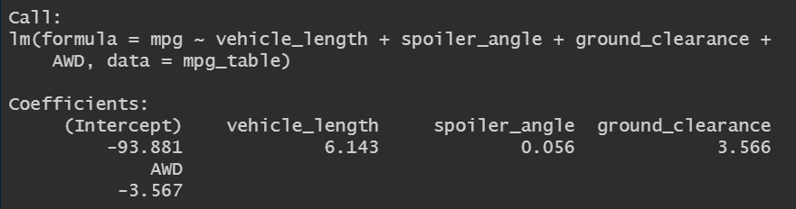

# MechaCar_Statistical_Analysis

## Linear Regression to Predict MPG

Peak usage hours are 5-6pm and to a lesser extent 8-9am. Bike maintenance is recommended overnight, ideally 2-5am, while usage is at its lowest.
  
(click the image to enlarge)
 
